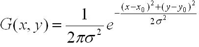

#运行环境
---------
- 	命令行即可编译/运行
-  不过，若需要自行编译，则需要进去make文件中把CCflags中的-I后的参数改为opencv头文件在电脑中的安装位置。
-  运行program，进入程序.
-  该程序的计算函数（atanX）使用了github上的一个开源项目sse_mathfun网址：
	[github ssemathfun](https://github.com/to-miz/sse_mathfun_extension.git)
	
#使用的SIMD指令集
-----
-	基本使用的是SSE、SSE2、SSE3、SSE4.1系列的指令集，使用的是128位的向量寄存器。

#优化函数介绍
----
##不足之处
-----
-	思前想后，觉得还是先说一些不足之处吧。虽然多数函数进行了SIMD优化，但是一些较为复杂的函数，比如高斯滤波函数以及极大值抑制函数暂时想不出如何处理多层循环嵌套+不可预测分支的程序向量化的思路，因此没有进行SIMD优化。而正因为逻辑较为复杂，所以这两个函数恰好就是程序中计算复杂度最高的，所以这个我的SIMD实现中，它的加速比只有23%。

##优化思路
----
-	现在来介绍一下这次在算法中的每个函数的具体优化过程。

###高斯核生成
----
-	高斯核的生成，其实是根据高斯公式得来的。这里生成的是二维高斯核。
公式如下：

-	根据公式我们可以得到他的串行实现。

```cpp
	Mat createGaussianKernel2D(int ksize,float sigma){
	Mat kernel = Mat::zeros(ksize,ksize,CV_32FC1);
	int center = ksize/2;
	float sum = 0;
	for(int i = 0;i < ksize;i ++){
		float *data = kernel.ptr<float>(i);//对kernel的每一行进行操作。
		for(int j = 0;j < ksize;j ++){
			float temp = ((-1)*((i - center)*(i - center)+(j - center)*(j - center)))/(2*sigma*sigma);
			data[j] = (1/(2*PI*sigma*sigma))*exp(temp);
			sum = sum + data[j];
		}
	}
	//这里可以通过调用函数来实现向量化。
	for(int i = 0;i < ksize;i ++){
		float *data = kernel.ptr<float>(i);
		for(int j = 0;j < ksize;j ++){
			data[j] = data[j]/sum;
		}
	}
	return kernel;
}
```
-	可以注意到的是，在这个函数中，内层循环这个过程其实是可以同时执行多个数据的，由于我使用的是128位的寄存器，所以我们一次性同时加载4个循环中的数据，然后对4个循环中的计算进行向量化。
-	最后向量化的结果如下：

```cpp
Mat simd_to_create(int ksize,float sigma){
	Mat kernel = Mat::zeros(ksize,ksize,CV_32FC1);
	float center = ksize/2;
	float double_sigma = (2*sigma*sigma);
	float PI_sigma = 1/(2*PI*sigma*sigma);
	float sum = 0;//32位
	__attribute__((aligned(16))) float temp[4] = {0,1,2,3};
	__m128 X,Y,Z;
	for(int i = 0;i < ksize;i ++){
		/*__attribute__((aligned(16)))*/ float *data = kernel.ptr<float>(i);
		int j;
		for(j = 0;j + 4 < ksize;j += 4){//128位专用寄存器，一次性可以处理4组32位变量的运算,4*32 
			X = _mm_load_ps(&temp[0] + j); // 将x加载到X（由于128位可以存放四个32位数据，所以默认一次加载连续的4个参数）
			float temp_data = j - center;
			Z = _mm_set_ps1(temp_data);
			Y = _mm_add_ps(X,Z);//开始计算
			Y = _mm_mul_ps(Y,Y);
			float temp_i = i - center;
			X = _mm_set_ps1(temp_i);
			X = _mm_mul_ps(X,X);
			Y = _mm_add_ps(Y,X);
			X = _mm_set_ps1(-1);
			Y = _mm_mul_ps(Y,X);
			X = _mm_set_ps1(double_sigma);
			Y = _mm_div_ps(Y,X);//wait to exp(Y)
			Y = FastExpSse(Y);
			X = _mm_set_ps1(PI_sigma);
			Y = _mm_mul_ps(X,Y);
			_mm_storeu_ps(data + j,Y);//将计算结果存入data
			sum = sum + data[j] + data[j + 1] + data[j + 2] + data[j + 3];
		}
		for(;j < ksize;j ++){//补全运算
			float temp_abc = ((-1)*((i - center)*(i - center)+(j - center)*(j - center)))/double_sigma;
			data[j] = PI_sigma*exp(temp_abc);
			sum = sum + data[j];
		}
	}
	Y = _mm_set_ps1(sum);
	for(int i = 0;i < ksize;i ++){//归一化向量化
		/*__attribute__((aligned(16)))*/ float *data =kernel.ptr<float>(i);
		for(int j = 0;j + 4 < ksize;j += 4){
			X = _mm_loadu_ps(data + j);
			X = _mm_div_ps(X,Y);
			_mm_storeu_ps(data + j,X);
		}
		data[4] = data[4]/sum;
	}
	return kernel;
}
```
###Sobel算子计算梯度
----
-	在canny算法中除了极大值抑制以及高斯滤波之外，计算耗时较高的函数就是Sobel算子计算梯度了。
- Sobel算子是一离散性差分算子，用来运算图像亮度函数的灰度之近似值。在图像的任何一点使用此算子，将会产生对应的灰度矢量或是其法矢量。
- 主要的计算过程：

	>	先对俩个方向进行求导，然后求出该方向的梯度角。
	
	
	>	求导的方式是将图像上的某些特定点与一个内核进行卷积。
	
	>	公式如下:
	
	> 	最后再通过如下公式计算梯度方向：
	
-	想给出求GX，GY以及梯度方向的串行实现：

```cpp
void SobelGradDirection(const Mat src,Mat &sobelx,Mat &sobely,float *pointDirection){
	for(int i =0;i < src.rows - 1;i ++){
		pointDirection[i] = 0;
	}
	sobelx = Mat::zeros(src.size(),CV_32SC1);
	sobely = Mat::zeros(src.size(),CV_32SC1);
	uchar* P = src.data;
	uchar* px = sobelx.data;
	uchar* py = sobely.data;
	int step = src.step;
	int stepXY = sobelx.step;
	long long k = 0;
	int i,j;
	for(i = 1;i < (src.rows - 1);i ++){
		for(j = 1;j <(src.cols - 1);j ++){
			float gradY = P[(i-1)*step + j + 1] + P[i*step + j + 1]*2 + P[(i + 1)*step + j + 1] -  P[(i-1)*step + j - 1] - P[i*step + j - 1]*2 - P[(i + 1)*step + j - 1];
			py[i * stepXY + j * (stepXY/step)] = abs(gradY);//不能直接store，因为不是放在一个连续的空间中。
			
			float gradX = P[(i+1)*step + j - 1] + P[(i + 1) * step + j] * 2+P[( i + 1) * step+ j + 1]-P[(i-1)*step+j-1]-P[(i-1)*step+j]*2-P[(i-1)*step+j+1];
			px[i * stepXY + j * (stepXY/step)] = abs(gradX);
			if(gradX == 0){
				gradX = 0.0000000001;//防止除法为0
			}
			pointDirection[k] = atan(gradY/gradX)*57.3;
			pointDirection[k] += 90;
			k ++;
		}
	}
	convertScaleAbs(sobelx,sobelx);//对于每个输入数组的元素函数convertScaleAbs 进行三次操作依次是：缩放，得到一个绝对值，转换成无符号8位类型
	convertScaleAbs(sobely,sobely);
}
```

-	从上面的代码中我们可以看出这段代码其实也进行了大量的计算，当要注意的是由于求得的GX，GY并不是直接放在数组的一段连续空间中的，所以我们需要不能之间store到px和py数组中。为此我先讲最后求得的四个结果想放在一个中间数组中，然后再转入目标数组。但是这样必定会带来I/O开销。

- 除了上述说到的问题之外，我们需要注意到，最后在求梯度方向的时候，还需要判断GX（分母）的值是否为0。由于向量化指令集并不是为了来处理这些需要跳转的指令的，这样违背了他的初衷。于是需要去使用一些trick来解决这个问题。
- 方案：

	假设我们最后得到的GX中有一个0:
	
	0001（32位）| 0000（32位）|0011（32位）|0101（32位）
	-----|-----|------|----
	
	然后我采取的思想是：然后GX减0，然后让他的结果与0比较，为0的话，全部置为1，不为0的化全置为0。得到下列的结果（mask）：
	
	0000（32位）| 1111（32位）|0000（32位）|0000（32位）
	-----|-----|------|----

	然后将得到的结果与32位的1进行与运算，将mask改为如下结果：
	
	0000（32位）| 0001（32位）|0000（32位）|0000（32位）
	-----|-----|------|----
	
	最后将得到的mask与存放GX的向量寄存器相或，既可以将GX中全为0的数改为1。
	
-	贴出SIMD代码：

```cpp
void simd_SobelGradDirection(const Mat src,Mat &sobelx,Mat &sobely,float *pointDirection){
	for(int i =0;i < src.rows - 1;i ++){
		pointDirection[i] = 0;
	}
	sobelx = Mat::zeros(src.size(),CV_32SC1);
	sobely = Mat::zeros(src.size(),CV_32SC1);
	uchar* P = src.data;
	uchar* px = sobelx.data;
	uchar* py = sobely.data;
	float temp[20];
	float temp1[20];
	uchar for_px[512];//can't be the point ,all can not use the point type change
	uchar for_py[512];
	int step = src.step;
	int stepXY = sobelx.step;
	long long k = 0;
	int i,j;
	__m128i X,Y;

	__m128 floats1,floats2,floats3,floats4,sub_min,mask,mask_low1;
	mask_low1 = _mm_set1_ps(1);
	for(i = 1;i < (src.rows - 1);i ++){
		for(j = 1;j + 4 <(src.cols - 1);j = j + 4){
			X = _mm_loadu_si128((__m128i*)(P + ((i - 1) * step + j + 1)));
			Y = _mm_loadu_si128((__m128i*)(P + i * step + j + 1));
			X = _mm_cvtepu8_epi32(X);//8->32 整形。
			Y = _mm_cvtepu8_epi32(Y);
			floats1 = _mm_cvtepi32_ps(X);//整型-> floats
			floats2 = _mm_cvtepi32_ps(Y);
			floats2 = _mm_add_ps(floats2,floats2);
			floats1 = _mm_add_ps(floats1,floats2);
			X = _mm_loadu_si128((__m128i*)(P + ((i + 1) * step + j + 1)));
			X = _mm_cvtepu8_epi32(X);
			floats2 = _mm_cvtepi32_ps(X);
			floats1 = _mm_add_ps(floats1,floats2);
			X = _mm_loadu_si128((__m128i*)(P + ((i - 1) * step + j - 1)));
			X = _mm_cvtepu8_epi32(X);
			floats2 = _mm_cvtepi32_ps(X);
			floats1 = _mm_sub_ps(floats1,floats2);
			X = _mm_loadu_si128((__m128i*)(P + (i * step + j - 1)));
			X = _mm_cvtepu8_epi32(X);
			floats2 = _mm_cvtepi32_ps(X);
			floats2 = _mm_add_ps(floats2,floats2);
			floats1 = _mm_sub_ps(floats1,floats2);
			X = _mm_loadu_si128((__m128i*)(P + ((i + 1) * step + j - 1)));
			X = _mm_cvtepu8_epi32(X);
			floats2 = _mm_cvtepi32_ps(X);
			floats1 = _mm_sub_ps(floats1,floats2);
			floats3 = floats1;
			//_mm_storeu_ps(temp,floats1);
			//
			//
			floats1 = abs_vec(floats1);
			X = _mm_cvtps_epi32(floats1);    // Convert them to 32-bit ints
   			X = _mm_packus_epi32(X, X);        // Pack down to 16 bits
    		X = _mm_packus_epi16(X, X);        // Pack down to 8 bits
    		*(int *)for_py = _mm_cvtsi128_si32(X); // Store the lower 32 bits
    		py[i * stepXY + j * (stepXY/step)] = for_py[0];
    		py[i * stepXY + (j + 1) * (stepXY/step)] = for_py[1];
    		py[i * stepXY + (j + 2) * (stepXY/step)] = for_py[2];
    		py[i * stepXY + (j + 3) * (stepXY/step)] = for_py[3];
			X = _mm_loadu_si128((__m128i*)(P + (i + 1) * step + j - 1));
			Y = _mm_loadu_si128((__m128i*)(P + (i + 1) * step + j ));
			X = _mm_cvtepu8_epi32(X);//8->32 整形。
			Y = _mm_cvtepu8_epi32(Y);
			floats1 = _mm_cvtepi32_ps(X);//整型-> floats
			floats2 = _mm_cvtepi32_ps(Y);
			floats2 = _mm_add_ps(floats2,floats2);
			floats1 = _mm_add_ps(floats1,floats2);
			X = _mm_loadu_si128((__m128i*)(P + ((i + 1) * step + j + 1)));
			X = _mm_cvtepu8_epi32(X);
			floats2 = _mm_cvtepi32_ps(X);
			floats1 = _mm_add_ps(floats1,floats2);
			X = _mm_loadu_si128((__m128i*)(P + ((i - 1) * step + j - 1)));
			X = _mm_cvtepu8_epi32(X);
			floats2 = _mm_cvtepi32_ps(X);
			floats1 = _mm_sub_ps(floats1,floats2);
			X = _mm_loadu_si128((__m128i*)(P + ((i - 1) * step + j)));
			X = _mm_cvtepu8_epi32(X);
			floats2 = _mm_cvtepi32_ps(X);
			floats2 = _mm_add_ps(floats2,floats2);
			floats1 = _mm_sub_ps(floats1,floats2);
			X = _mm_loadu_si128((__m128i*)(P + ((i - 1) * step + j + 1)));
			X = _mm_cvtepu8_epi32(X);
			floats2 = _mm_cvtepi32_ps(X);
			floats1 = _mm_sub_ps(floats1,floats2);
			floats4 = floats1;
			floats1 = abs_vec(floats1);
			//_mm_storeu_ps(temp1,floats4);
			X = _mm_cvtps_epi32(floats1);    // Convert them to 32-bit ints
   			X = _mm_packus_epi32(X, X);        // Pack down to 16 bits
    		X = _mm_packus_epi16(X, X);        // Pack down to 8 bits
    		*(int *)for_px = _mm_cvtsi128_si32(X); // Store the lower 32 bits
			px[i * stepXY + j * (stepXY/step)] = for_px[0];
    		px[i * stepXY + (j + 1) * (stepXY/step)] = for_px[1];
    		px[i * stepXY + (j + 2) * (stepXY/step)] = for_px[2];
    		px[i * stepXY + (j + 3) * (stepXY/step)] = for_px[3];
    		sub_min = _mm_sub_ps(floats4,_mm_setzero_ps());
    		mask = _mm_cmpeq_ps(sub_min,_mm_setzero_ps());
    		mask = _mm_and_ps(mask,mask_low1);//判断gradX是否为0，为0的话，最低位改为1
    		floats4 = _mm_or_ps(mask,floats4);
    		floats3 = _mm_div_ps(floats3,floats4);
    		floats3 = atan_ps(floats3);
    		floats4 = _mm_set1_ps(57.3);
    		floats3 = _mm_mul_ps(floats3,floats4);
    		floats4 = _mm_set1_ps(90);
    		floats3 = _mm_add_ps(floats4,floats3);
    		_mm_storeu_ps(pointDirection + k,floats3);
    		k = k + 4;
		}
		for(;j < (src.cols- 1);j ++){
			float gradY = P[(i-1)*step + j + 1] + P[i*step + j + 1]*2 + P[(i + 1)*step + j + 1] -  P[(i-1)*step + j - 1] - P[i*step + j - 1]*2 - P[(i + 1)*step + j - 1];
			py[i * stepXY + j * (stepXY/step)] = abs(gradY);
			float gradX = P[(i+1)*step + j - 1] + P[(i + 1) * step + j] * 2+P[( i + 1) * step+ j + 1]-P[(i-1)*step+j-1]-P[(i-1)*step+j]*2-P[(i-1)*step+j+1];
			px[i * stepXY + j * (stepXY/step)] = abs(gradX);
			if(gradX == 0){
				gradX = 0.0000000001;//防止除法为0
			}
			pointDirection[k] = atan(gradY/gradX)*57.3;
			pointDirection[k] += 90;
			k ++;
		}
	}

	convertScaleAbs(sobelx,sobelx);//对于每个输入数组的元素函数convertScaleAbs 进行三次操作依次是：缩放，得到一个绝对值，转换成无符号8位类型
	convertScaleAbs(sobely,sobely);
}
```

###Sobel算子计算幅值
------
-	使用如下公式进行计算即可：
	
	
-	该计算的部分就是平方求和后开方，intrinsic中有相关的计算函数。
- 	直接给出SIMD代码实现。

```cpp
void simd_SobelAmplitude(Mat &sobelx,Mat &sobely,Mat &SobelXY){
	SobelXY = Mat::zeros(sobelx.size(),CV_32FC1);
	__m128i X,Y;
	__m128 floats1,floats2;
	for(int i = 0;i < SobelXY.rows;i ++){
		float *data = SobelXY.ptr<float>(i);
		uchar *datax = sobelx.ptr<uchar>(i);
		uchar *datay = sobely.ptr<uchar>(i);
		int j;
		for(j = 0;j + 4 < SobelXY.cols;j = j + 4){
			X = _mm_loadu_si128((__m128i*)(datax + j));
			Y = _mm_loadu_si128((__m128i*)(datay + j));
			X = _mm_cvtepu8_epi32(X);//8->32 整形。
			Y = _mm_cvtepu8_epi32(Y);
			floats1 = _mm_cvtepi32_ps(X);//整型-> floats，得到dataX
			floats2 = _mm_cvtepi32_ps(Y);//得到dataY
			floats1 = _mm_mul_ps(floats1,floats1);
			floats2 = _mm_mul_ps(floats2,floats2);
			floats1 = _mm_add_ps(floats1,floats2);
			floats1 = _mm_sqrt_ps(floats1);
			_mm_storeu_ps(data + j,floats1);
		}
		for(;j < SobelXY.cols;j ++){
			data[j] = sqrt(datax[j] * datax[j] + datay[j]*datay[j]);

		}
	}
	convertScaleAbs(SobelXY,SobelXY);
}
```

###双阙值抑制
------

-	该算法就是对于我们所指定的一高一低两个阙值，这俩个值决定了一个范围。对于图像中的某个元素的值大于最大值时，将该值设为255，小于最低值则设为0。

-	这样的算法实现起来比较简单，给出串行代码：

```cpp
void DoubleThreshold(Mat &Input,uchar LowThreshod,uchar highThreshold){
	for(int i = 0;i < Input.rows;i ++){
		uchar *data = Input.ptr<uchar>(i);
		int j;
		for(int j = 0;j < Input.cols;j = j + 1){
			if(data[j] > highThreshold){
				data[j] = 255;
			}
			if(data[j] < LowThreshod){
				data[j] = 0;
			}
		}
	}
}
```

-	到了SIMD实现中，同样的要处理俩个分支判断语句。我的思路和解决sobel算子中的判断是一样的。

-	首先我们先求出该值和俩个阙值的差，sub_min和sub_max。然后如果sub_max大于0，则说明该值大于阙值。如果sub_min小于0，则说明该值小于阙值。

sub_max:

	-10|-1|-2|3
	----|-----|---|---|----
	
sub_min:
	-1|-10|2|-3
	----|-----|---|---|----
	
然后将得到的sub_min 和sub_max与全0比较，如果sub_min>0,则将那一个大于0的8位数置为1，否则设为0，如果sub_max>0,则将那一个大于0的8位数置为1，否则为0.

mask_hi:

	0|0|0|1
	----|-----|---|---|----
	
mask_lo:

	0|0|1|0
	----|-----|---|---|----
	
然后将mask_hi与原值相或，即可将该值改为255，将mask_lo与原值相与，可将该值设为0.

-	给出SIMD代码实现：

```cpp
void simd_DoubleThreshold(Mat &Input,uchar LowThreshod,uchar highThreshold){
	__m128i loaded8,sub_min,sub_max,mask_hi,mask_lo;
 	for(int i = 0;i < Input.rows;i ++){
		uchar *data = Input.ptr<uchar>(i);
		int j;
		for(j = 0;j + 16 < Input.cols;j = j + 16){
			//cout << "a" << endl;
			loaded8 = _mm_loadu_si128((__m128i*)(data + j));
			//subtract 128 from every 8-bit int
 			sub_min = _mm_sub_epi8(loaded8, _mm_set1_epi8(LowThreshod));
 			sub_max = _mm_sub_epi8(loaded8, _mm_set1_epi8(highThreshold));
 			mask_hi = _mm_cmpgt_epi8(sub_max,_mm_setzero_si128());//submax>0 8位全1，否则全0
 			mask_lo = _mm_cmpgt_epi8(sub_min,_mm_setzero_si128());//submin<=0,8位全0，否则全1
 			loaded8 = _mm_and_si128(loaded8, mask_lo);
 			loaded8 = _mm_or_si128(loaded8,mask_hi);
 			_mm_storeu_si128((__m128i *)(data + j), loaded8);
 			//cout << "i: " << i << "j: "<< j << endl;

 			//greater than top limit?
 		}
 		for(;j < Input.cols;j = j + 1){
			if(data[j] > highThreshold){
				data[j] = 255;
			}
			if(data[j] < LowThreshod){
				data[j] = 0;
			}
		}
		//cout << i << endl;
	 }
}
```

###一些小技巧：
------
-	由于Mat结构中存下的元素访问时是使用uchar类型的，一个uchar类型8位，所以在导入的时候我们一次会加载16个uchar类型，这个时候我们需要判断接下来的操作需不需要将uchar转为float，如果需要我们可以有下列的操作转化：

```cpp
X = _mm_loadu_si128((__m128i*)(datax + j));//加载16个8位的数据
X = _mm_cvtepu8_epi32(X);//8->32 整形。
floats1 = _mm_cvtepi32_ps(X);//整型-> floats
```

-	如果不用转为32位数据的话，我们可以直接使用指令集提供的8位操作运算函数（算数运算、比较、逻辑判断等）。
如下：

```cpp
loaded8 = _mm_loadu_si128((__m128i*)(data + j));//加载128位数据，其中有16个8位数据。
//subtract 128 from every 8-bit int
sub_min = _mm_sub_epi8(loaded8, _mm_set1_epi8(LowThreshod));
sub_max = _mm_sub_epi8(loaded8, _mm_set1_epi8(highThreshold));
mask_hi = _mm_cmpgt_epi8(sub_max,_mm_setzero_si128());//submax>0 8位全1，否则全0
mask_lo = _mm_cmpgt_epi8(sub_min,_mm_setzero_si128());//submin<=0,8位全0，否则全1
loaded8 = _mm_and_si128(loaded8, mask_lo);
loaded8 = _mm_or_si128(loaded8,mask_hi);//存下128位数据
mm_storeu_si128((__m128i *)(data + j), loaded8);
```

#实验结果
=====

-	最后实验结果：


-	最后我们可以看出，高斯滤波由于优化了高斯滤波核的生成，但是高斯滤波的过程并没有取得优化。所以耗时由34775us下降到27584，加速比为26.06%。而Sobel算子求梯度的函数由9085us降到2143us，加速了3.23倍，Sobel算子求幅值的函数由987us,降到431us，加速了1.29倍。双阙值抑制由628us降到了73us，加速了7.60倍。这个算法加速了25%。

-	但是由于没有优化极大值抑制函数以及高斯滤波的过程，这俩个函数消耗时间权重最高，所以整个算法加速率并没有很大。
